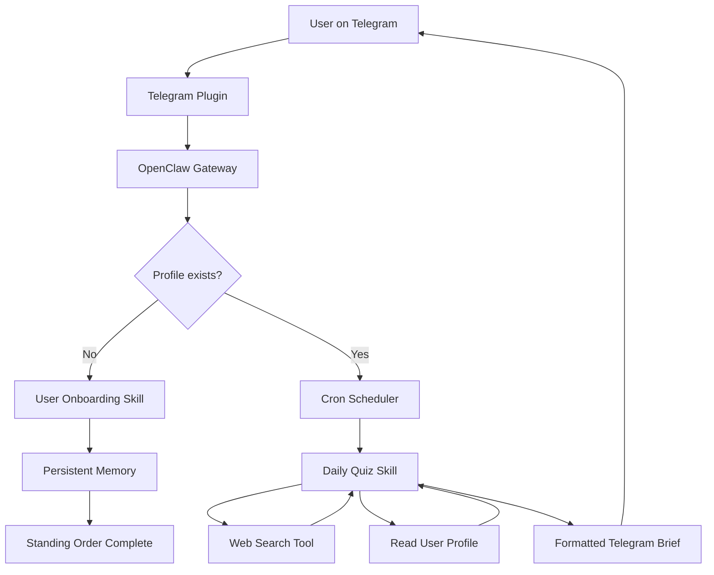
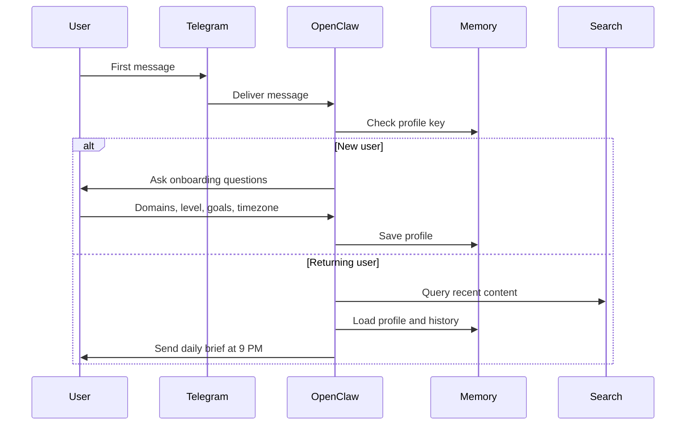
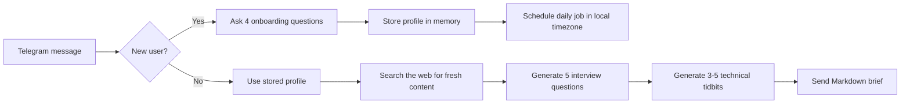

# OpenClaw Telegram Learning Assistant


A personalized AI learning assistant for Telegram. The bot onboards each user, stores their learning profile in persistent memory, searches for fresh technical content every day, and sends a curated evening brief with interview questions and technical insights.

## Overview

This project uses OpenClaw as a self-hosted agent gateway. The Telegram bot is not a generic chat wrapper; it is a small agent system with four moving parts:

- a **standing order** that starts onboarding for brand-new users
- a **daily cron job** that generates the evening brief at 9 PM in the user's timezone
- two **skills** that encode the business logic in Markdown
- persistent **memory** that keeps user preferences and history between runs

The result is a practical AI learning companion that feels personal, proactive, and repeatable.

## Tech Stack

| Layer | Technology | Why it is here |
|---|---|---|
| Runtime | Node.js 20+ | OpenClaw is shipped as an npm package and works well in a containerized Node runtime |
| Agent framework | OpenClaw | Provides skills, memory, cron, channels, and tool execution |
| LLM | Ollama with `llama3:8b` | Local, private, and easy to run for development |
| Messaging | Telegram Bot API | Main user interface and delivery channel |
| Search | DuckDuckGo by default, optional SearXNG | Fresh web search for daily curation |
| Packaging | Docker and Docker Compose | Reproducible setup and deployment |
| Version control | Git | Project tracking and submission workflow |

## Visual Workflow







## Code Structure

```text
openclaw-telegram-learning-assistant/
├── config/
│   ├── openclaw.json              OpenClaw main configuration without secrets
│   ├── cron.json                  Cron job definitions (nightly-tech-brief at 0 21 * * *)
│   └── standing-orders.json       Standing order definitions (trigger-user-onboarding)
├── skills/
│   ├── user-onboarding/
│   │   └── SKILL.md               Onboarding workflow and memory schema
│   └── daily-quiz/
│       └── SKILL.md               Search, synthesis, and Telegram formatting rules
├── Dockerfile                     Container image for the OpenClaw agent
├── docker-compose.yml             Ollama + gateway + optional SearXNG
├── entrypoint.sh                  Container startup helper
├── .env.example                   Environment variable template
├── answers.md                     Written answers to project questionnaire
├── README.md                      Main project guide (this file)
├── architecture.md                Architecture-focused documentation
└── projectdocumentation.md        Detailed implementation documentation
```

## Onboarding Trigger: Standing Order

### Decision: Standing Order (not Webhook)

The onboarding flow is triggered by a **Standing Order** registered in `config/standing-orders.json`.

**Why Standing Order was chosen over a Webhook:**

| Criterion | Standing Order | Webhook |
|---|---|---|
| Setup complexity | Single config file, no external endpoints | Requires public HTTP server + TLS |
| External dependencies | None — runs inside the gateway | Needs infrastructure to receive HTTP calls |
| Memory integration | Native — condition can read memory directly | Requires custom logic to check memory state |
| Reliability | Gateway-managed, retried by the scheduler | Delivery not guaranteed; caller must retry |
| Security | No exposed surface area | Exposes an HTTP endpoint to the internet |
| Portability | Works identically locally and in Docker | Needs port forwarding or reverse proxy in dev |

Standing Orders are the better choice here because the triggering condition (`memory.user_profile_{{user.id}} does not exist`) is a runtime memory check that maps naturally to OpenClaw's built-in Standing Order mechanism. A Webhook would require exposing a server endpoint and writing custom memory-check logic outside the agent.

The Standing Order configuration is:

```json
{
  "name": "trigger-user-onboarding",
  "condition": "memory.user_profile_{{user.id}} does not exist",
  "runSkill": "user-onboarding",
  "channel": "telegram",
  "enabled": true
}
```

Equivalent CLI registration command (for local non-Docker setup):

```bash
openclaw standing-orders add \
  --name "trigger-user-onboarding" \
  --if "memory.user_profile_{{user.id}} does not exist" \
  --run-skill "user-onboarding"
```

## Cron Job: Nightly Tech Brief

The daily quiz is triggered by the `nightly-tech-brief` cron job registered in `config/cron.json`.

**Schedule:** `0 21 * * *` — 9:00 PM every day  
**Timezone:** Resolved per-user from their stored memory profile  
**Session:** Isolated (clean context for each run)  
**Channel:** Telegram

Equivalent CLI registration command (for local non-Docker setup):

```bash
openclaw cron add \
  --name "nightly-tech-brief" \
  --cron "0 21 * * *" \
  --tz "America/New_York" \
  --session isolated \
  --message "Run the daily-quiz skill for the primary user. Retrieve their preferences from memory, search the web for fresh content in their domains, generate exactly 5 interview questions and 3-5 tidbits, format in Telegram Markdown, and send via the Telegram channel." \
  --announce \
  --channel telegram
```

## Workflow Explanation

### 1. Onboarding

When a Telegram user sends the first message, OpenClaw checks whether `user_profile_{{user.id}}` exists in memory. If it does not, the onboarding skill starts a short interview that captures:

- technical domains
- experience level
- learning goals
- timezone

That profile is stored as structured JSON so later jobs can read it without extra parsing logic.

### 2. Daily Generation

At 9 PM in the user's timezone, the cron job starts the daily quiz skill. The skill:

- reads the user profile from memory
- searches the web for recent content in the selected domains
- synthesizes 3 to 5 useful technical tidbits
- generates exactly 5 interview questions matched to the user's level
- formats the final brief for Telegram Markdown

### 3. Delivery

The Telegram plugin sends the final brief back to the user. The message keeps a predictable structure so it reads cleanly on mobile devices.

## Execution Flow


## OpenClaw Configuration Snippet

The main configuration file is at `config/openclaw.json`. No real secrets are stored — all sensitive values use environment variable substitution:

```json
{
  "gatewayVersion": "1.0",
  "model": {
    "provider": "ollama",
    "model": "llama3:8b",
    "ollamaHost": "${env.OLLAMA_HOST}"
  },
  "plugins": {
    "entries": {
      "telegram": {
        "enabled": true,
        "package": "@openclaw/plugin-telegram",
        "config": {
          "botToken": "${env.TELEGRAM_BOT_TOKEN}"
        }
      }
    }
  },
  "webSearch": {
    "provider": "duckduckgo",
    "enabled": true
  },
  "memory": {
    "type": "persistent",
    "location": "/root/.openclaw/memory"
  },
  "automation": {
    "cron": {
      "enabled": true,
      "configFile": "/root/.openclaw/config/cron.json"
    },
    "standingOrders": {
      "enabled": true,
      "configFile": "/root/.openclaw/config/standing-orders.json"
    }
  }
}
```

## Run Locally

### Prerequisites

- Node.js 20 or newer
- Docker and Docker Compose
- Telegram account and BotFather access
- A Telegram bot token

### Setup

```bash
git clone https://github.com/ramalokeshreddyp/openclaw-telegram-learning-assistant.git
cd openclaw-telegram-learning-assistant
cp .env.example .env
```

Edit `.env` and set `TELEGRAM_BOT_TOKEN`.

### Start the stack

```bash
docker compose up --build
```

If you want self-hosted search, run:

```bash
docker compose --profile with-searxng up --build
```

### Test the bot

1. Open Telegram and find your bot.
2. Send a first message such as `Hello`.
3. Complete the onboarding prompts.
4. Wait for the daily cron job or trigger it manually.

### Manual validation commands

```bash
# Start the gateway locally (without Docker)
openclaw gateway start

# List registered standing orders
openclaw standing-orders list

# List registered cron jobs
openclaw cron list

# Manually trigger the nightly brief for immediate testing
openclaw cron trigger "nightly-tech-brief"

# Inspect a user's stored profile (replace with actual user ID)
openclaw memory get "user_profile_{{user.id}}"
```

## Setup and Installation Steps

### Docker path

1. Create a Telegram bot with `@BotFather`.
2. Copy `.env.example` to `.env` and insert the bot token.
3. Run `docker compose up --build`.
4. Open Telegram and start chatting with the bot.

### Local path

1. Install OpenClaw globally with `npm i -g openclaw`.
2. Run `ollama serve` in one terminal.
3. Pull a model with `ollama pull llama3:8b`.
4. Run `openclaw onboard`.
5. Add the Telegram plugin configuration in `~/.openclaw/openclaw.json`.
6. Start the gateway with `openclaw gateway start`.

## Usage Instructions

### New user flow

1. User sends first Telegram message.
2. Standing order detects missing profile (`trigger-user-onboarding` in `config/standing-orders.json`).
3. Onboarding skill asks the four required questions.
4. Profile is saved in memory under `user_profile_{{user.id}}`.
5. Daily brief starts using the stored timezone.

### Returning user flow

1. Cron job (`nightly-tech-brief`) triggers at 9 PM in the stored timezone.
2. Daily quiz skill loads profile from memory.
3. Web search collects fresh domain-specific content.
4. The skill produces 5 questions and 3 to 5 tidbits.
5. Telegram receives the final Markdown brief.

## Expected Daily Brief Format

```
🦞 *Your Daily Tech Brief* — May 21, 2026

━━━━━━━━━━━━━━━━━━━━
🧠 *Interview Questions*
━━━━━━━━━━━━━━━━━━━━

*Q1 [Conceptual — Go]*
Explain how Go's goroutines differ from OS threads and why this matters for concurrent systems.

*Q2 [Coding — Python]*
Write a function that detects cycles in a directed graph using DFS.

*Q3 [System Design — Distributed Systems]*
Design a fault-tolerant message queue that can handle 1M messages/sec.

*Q4 [Behavioral — General]*
Describe a time you had to debug a critical production issue under pressure.

*Q5 [Conceptual — Distributed Systems]*
What are the trade-offs between strong and eventual consistency in distributed databases?

━━━━━━━━━━━━━━━━━━━━
💡 *Today's Tidbits*
━━━━━━━━━━━━━━━━━━━━

• Go 1.21's improved range-over-function iterators eliminate boilerplate loop patterns, making code more readable and reducing off-by-one errors in collection processing.

• Python 3.13's experimental free-threaded mode (no GIL) enables true multi-core parallelism for CPU-bound tasks, a shift that may reshape how Python async and threading are used together.

• A 2024 study found that teams using structured logging (JSON format) reduced mean time to debug production incidents by 40% compared to unstructured plain-text logs.

━━━━━━━━━━━━━━━━━━━━
Reply *answers* to share your answers for feedback, or *more* for extra questions.
```

## Configuration

The main configuration lives in [config/openclaw.json](config/openclaw.json). Supporting automation configs are in:

- [config/cron.json](config/cron.json) — cron job definitions
- [config/standing-orders.json](config/standing-orders.json) — standing order definitions

These define:

- the model provider and model name
- the Telegram channel plugin
- the web search provider
- persistent memory settings
- automation support for cron and standing orders

No secrets are committed. Use `.env` for `TELEGRAM_BOT_TOKEN` and any optional API keys.

## Why this design works

- It keeps business logic in skills, not in brittle code.
- It keeps user data in memory instead of mixing state into prompts.
- It makes scheduling timezone-aware and automatic.
- It supports local-only operation through Ollama.
- It keeps the system easy to understand, extend, and test.
- Standing Order trigger requires no external server or public endpoint.
- Cron config is version-controlled and reproducible.

## Related Documentation

- [architecture.md](architecture.md)
- [projectdocumentation.md](projectdocumentation.md)
- [answers.md](answers.md)

## Requirements Snapshot

This repository includes the required artifacts for the submission:

| Requirement | File | Status |
|---|---|---|
| User onboarding skill | `skills/user-onboarding/SKILL.md` | ✅ |
| Daily quiz skill | `skills/daily-quiz/SKILL.md` | ✅ |
| Memory schema | Defined in onboarding skill | ✅ |
| Cron job (nightly-tech-brief) | `config/cron.json` | ✅ |
| Onboarding trigger (Standing Order) | `config/standing-orders.json` | ✅ |
| Telegram Markdown format | Defined in daily-quiz skill | ✅ |
| OpenClaw config (no secrets) | `config/openclaw.json` | ✅ |
| README with setup guide | `README.md` | ✅ |
| web_search tool usage | `skills/daily-quiz/SKILL.md` | ✅ |
| Docker containerization | `Dockerfile`, `docker-compose.yml`, `.env.example` | ✅ |

## Final Notes

The project is structured to be reproducible, readable, and submission-ready. If you are reviewing the system as a technical evaluator, start with `README.md`, then open `architecture.md` for design details and `projectdocumentation.md` for the full implementation story.
