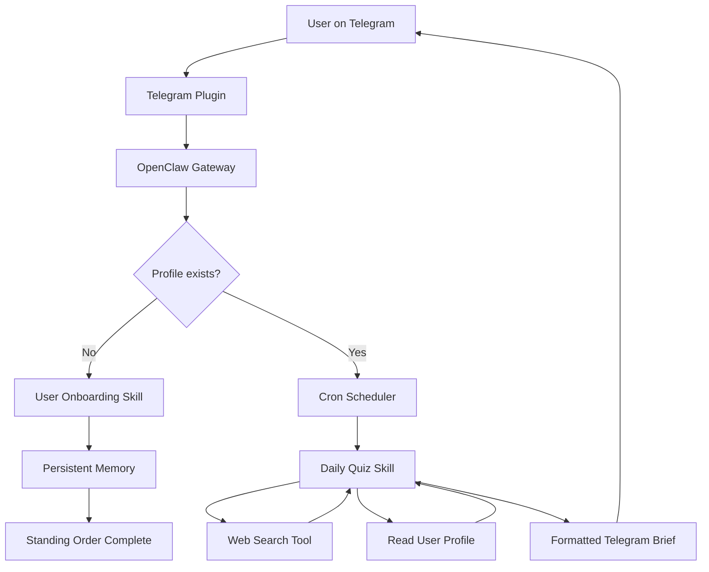
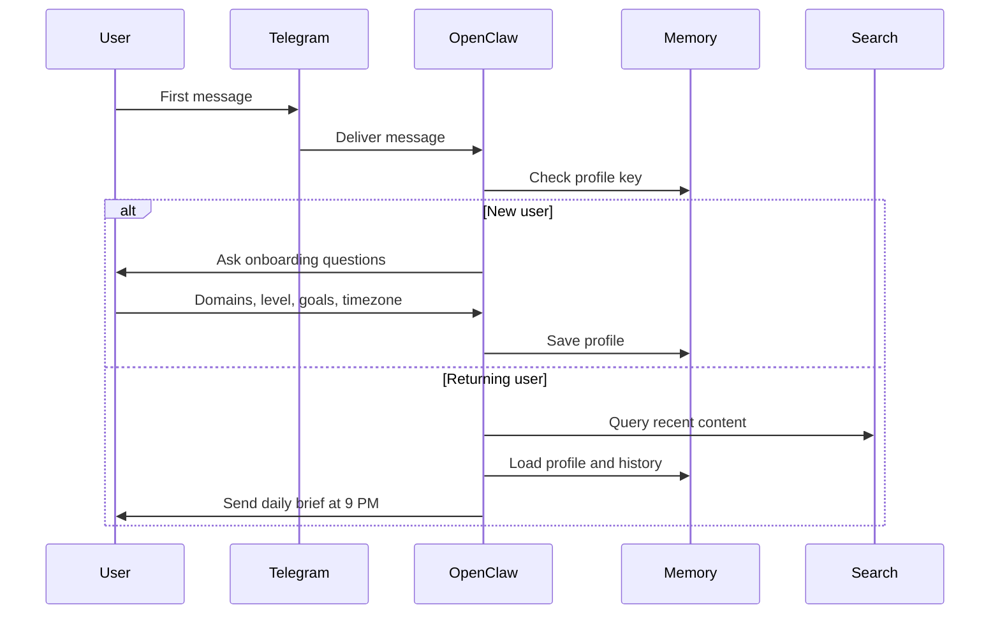
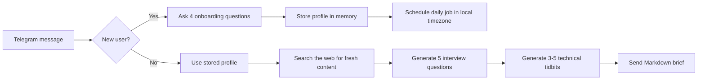
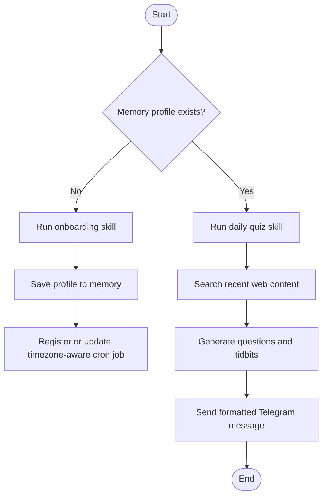

# OpenClaw Telegram Learning Assistant


A personalized AI learning assistant for Telegram. The bot onboards each user, stores their learning profile in persistent memory, searches for fresh technical content every day, and sends a curated evening brief with interview questions and technical insights.

## Overview

This project uses OpenClaw as a self-hosted agent gateway. The Telegram bot is not a generic chat wrapper; it is a small agent system with four moving parts:

- a **standing order** that starts onboarding for brand-new users
- a **daily cron job** that generates the evening brief at 9 PM in the user's timezone
- two **skills** that encode the business logic in Markdown
- persistent **memory** that keeps user preferences and history between runs

The result is a practical AI learning companion that feels personal, proactive, and repeatable.

## Tech Stack

| Layer | Technology | Why it is here |
|---|---|---|
| Runtime | Node.js 20+ | OpenClaw is shipped as an npm package and works well in a containerized Node runtime |
| Agent framework | OpenClaw | Provides skills, memory, cron, channels, and tool execution |
| LLM | Ollama with `llama3:8b` | Local, private, and easy to run for development |
| Messaging | Telegram Bot API | Main user interface and delivery channel |
| Search | DuckDuckGo by default, optional SearXNG | Fresh web search for daily curation |
| Packaging | Docker and Docker Compose | Reproducible setup and deployment |
| Version control | Git | Project tracking and submission workflow |

## Visual Workflow







## Code Structure

```text
openclaw-telegram-learning-assistant/
├── config/
│   └── openclaw.json              OpenClaw configuration without secrets
├── skills/
│   ├── user-onboarding/
│   │   └── SKILL.md               Onboarding workflow and memory schema
│   └── daily-quiz/
│       └── SKILL.md               Search, synthesis, and Telegram formatting rules
├── Dockerfile                     Container image for the OpenClaw agent
├── docker-compose.yml             Ollama + gateway + optional SearXNG
├── entrypoint.sh                  Container startup helper
├── .env.example                   Environment variable template
├── README.md                     Main project guide
├── architecture.md               Architecture-focused documentation
└── projectdocumentation.md       Detailed implementation documentation
```

## Workflow Explanation

### 1. Onboarding
When a Telegram user sends the first message, OpenClaw checks whether `user_profile_{{user.id}}` exists in memory. If it does not, the onboarding skill starts a short interview that captures:

- technical domains
- experience level
- learning goals
- timezone

That profile is stored as structured JSON so later jobs can read it without extra parsing logic.

### 2. Daily Generation
At 9 PM in the user's timezone, the cron job starts the daily quiz skill. The skill:

- reads the user profile from memory
- searches the web for recent content in the selected domains
- synthesizes 3 to 5 useful technical tidbits
- generates exactly 5 interview questions matched to the user's level
- formats the final brief for Telegram Markdown

### 3. Delivery
The Telegram plugin sends the final brief back to the user. The message keeps a predictable structure so it reads cleanly on mobile devices.

## Execution Flow



## Run Locally

### Prerequisites

- Node.js 20 or newer
- Docker and Docker Compose
- Telegram account and BotFather access
- A Telegram bot token

### Setup

```bash
git clone https://github.com/ramalokeshreddyp/openclaw-telegram-learning-assistant.git
cd openclaw-telegram-learning-assistant
cp .env.example .env
```

Edit `.env` and set `TELEGRAM_BOT_TOKEN`.

### Start the stack

```bash
docker compose up --build
```

If you want self-hosted search, run:

```bash
docker compose --profile with-searxng up --build
```

### Test the bot

1. Open Telegram and find your bot.
2. Send a first message such as `Hello`.
3. Complete the onboarding prompts.
4. Wait for the daily cron job or trigger it manually.

### Manual validation commands

```bash
openclaw gateway start
openclaw standing-orders list
openclaw cron list
openclaw cron trigger "nightly-tech-brief"
openclaw memory get "user_profile_{{user.id}}"
```

## Setup and Installation Steps

### Docker path

1. Create a Telegram bot with `@BotFather`.
2. Copy `.env.example` to `.env` and insert the bot token.
3. Run `docker compose up --build`.
4. Open Telegram and start chatting with the bot.

### Local path

1. Install OpenClaw globally with `npm i -g openclaw`.
2. Run `ollama serve` in one terminal.
3. Pull a model with `ollama pull llama3:8b`.
4. Run `openclaw onboard`.
5. Add the Telegram plugin configuration in `~/.openclaw/openclaw.json`.
6. Start the gateway with `openclaw gateway start`.

## Usage Instructions

### New user flow

1. User sends first Telegram message.
2. Standing order detects missing profile.
3. Onboarding skill asks the four required questions.
4. Profile is saved in memory.
5. Daily brief starts using the stored timezone.

### Returning user flow

1. Cron job triggers at 9 PM in the stored timezone.
2. Daily quiz skill loads profile from memory.
3. Web search collects fresh domain-specific content.
4. The skill produces 5 questions and 3 to 5 tidbits.
5. Telegram receives the final Markdown brief.

## Configuration

The main configuration lives in [config/openclaw.json](config/openclaw.json). It defines:

- the model provider and model name
- the Telegram channel plugin
- the web search provider
- persistent memory settings
- automation support for cron and standing orders

No secrets are committed. Use `.env` for `TELEGRAM_BOT_TOKEN` and any optional API keys.

## Why this design works

- It keeps business logic in skills, not in brittle code.
- It keeps user data in memory instead of mixing state into prompts.
- It makes scheduling timezone-aware and automatic.
- It supports local-only operation through Ollama.
- It keeps the system easy to understand, extend, and test.

## Related Documentation

- [architecture.md](architecture.md)
- [projectdocumentation.md](projectdocumentation.md)

## Requirements Snapshot

This repository includes the required artifacts for the submission:

- `skills/user-onboarding/SKILL.md`
- `skills/daily-quiz/SKILL.md`
- `config/openclaw.json`
- `Dockerfile`
- `docker-compose.yml`
- `.env.example`
- `architecture.md`
- `projectdocumentation.md`

## Final Notes

The project is structured to be reproducible, readable, and submission-ready. If you are reviewing the system as a technical evaluator, start with `README.md`, then open `architecture.md` for design details and `projectdocumentation.md` for the full implementation story.
