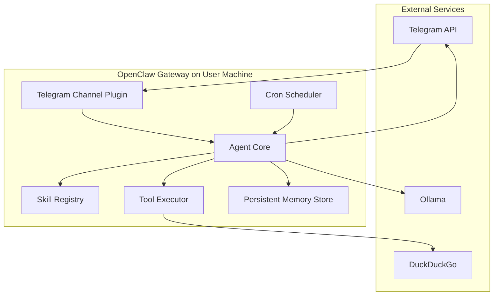
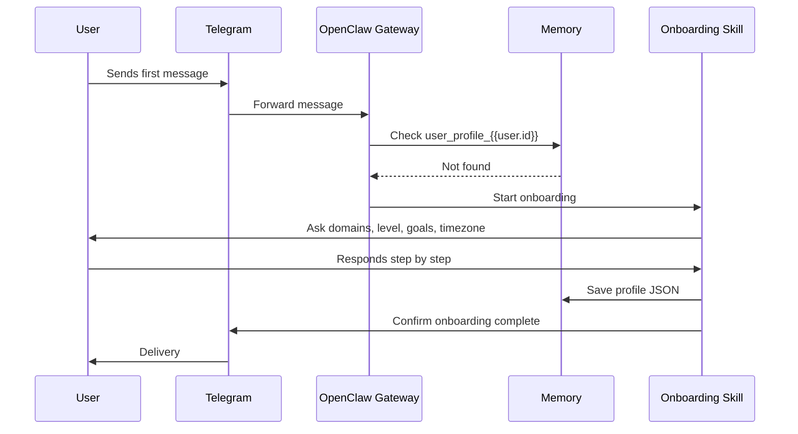
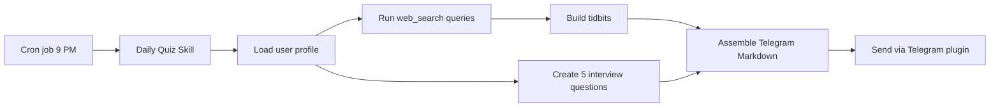
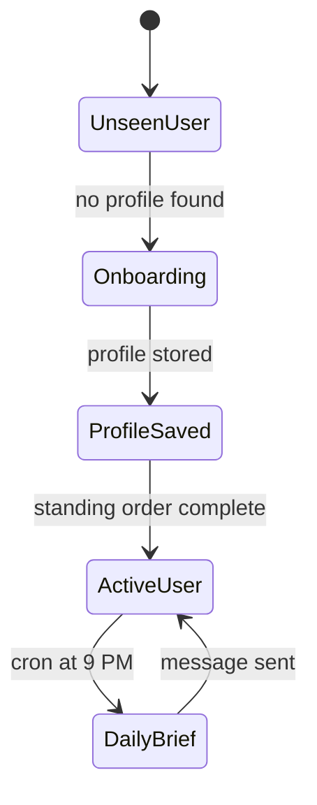

# Architecture Documentation

## 1. Main Idea and Objective

The objective of the OpenClaw Telegram Learning Assistant is to create a personalized, autonomous study companion that learns from each user's interests and delivers a daily technical brief through Telegram. The system is designed to be self-hosted, privacy-aware, and extensible.

The architecture separates the system into four stable layers:

- **Interaction layer**: Telegram as the user-facing channel
- **Agent layer**: OpenClaw Gateway and skills
- **State layer**: Persistent memory for user profiles and topic history
- **Automation layer**: Cron and standing orders for proactive behavior

The design goal is not just to answer chat messages. It is to behave like a small agent platform with memory, scheduling, search, and structured prompt workflows.

## 2. High-Level Architecture



## 3. Design Rationale

### Why this architecture

The project is built around the idea that long-term behavior should live in skills and memory, not in ad hoc procedural scripts. That keeps the system easier to maintain and safer to extend.

### Why Telegram

Telegram is lightweight, familiar, and well-suited to mobile delivery. It gives the assistant a clear, low-friction communication surface.

### Why OpenClaw

OpenClaw provides the primitives this project needs:

- skills for task definition
- memory for personalization
- cron for recurring automation
- channel plugins for messaging
- tools for web search and storage

### Why Ollama

Ollama enables local development with no mandatory API cost. The system can also be switched to a cloud model later if higher reasoning quality is needed.

## 4. Core Components and Responsibilities

### 4.1 Telegram Channel Plugin

Responsibilities:

- receive messages from Telegram users
- forward user input to the agent core
- send onboarding and daily brief replies back to Telegram
- keep the assistant reachable from desktop and mobile clients

### 4.2 OpenClaw Gateway

Responsibilities:

- orchestrate message handling
- select the appropriate skill
- load and write memory
- execute scheduled jobs
- coordinate tool calls and response formatting

### 4.3 User Onboarding Skill

Responsibilities:

- ask the onboarding questions in sequence
- resolve vague answers with follow-up questions
- normalize domains, level, goals, and timezone
- store the profile under `user_profile_{{user.id}}`

### 4.4 Daily Quiz Skill

Responsibilities:

- fetch the user profile from memory
- search the web for fresh domain-specific content
- synthesize 3 to 5 technical tidbits
- generate exactly 5 interview questions
- format the final Telegram message

### 4.5 Persistent Memory Store

Responsibilities:

- persist user profiles across restarts
- track recently asked topics
- store engagement state and last brief date
- provide deterministic lookup by user id

### 4.6 Cron Scheduler

Responsibilities:

- trigger the daily brief every evening at 9 PM
- respect the timezone collected during onboarding
- ensure each job executes in an isolated session

### 4.7 Tool Executor

Responsibilities:

- call web search providers
- access memory
- send formatted messages through Telegram
- perform external actions that the LLM cannot do on its own

## 5. System Flow

### 5.1 New User Flow



### 5.2 Daily Brief Flow



## 6. Data Flow

The data model is intentionally small and predictable.

### Profile schema

```json
{
  "domains": ["Python", "distributed systems"],
  "level": "mid-level",
  "goals": ["interviews", "staying up to date"],
  "timezone": "America/New_York"
}
```

### Data flow steps

1. User message arrives in Telegram.
2. Plugin forwards the message to the gateway.
3. Gateway looks up the user profile in memory.
4. If no profile exists, onboarding is triggered.
5. Once profile exists, daily jobs use it to shape content.
6. Web search results are synthesized into useful learning material.
7. Final content is delivered back to Telegram.

## 7. Execution Flow Controls

The assistant uses three control mechanisms:

- **Conditional routing**: detect whether a profile exists
- **Standing order**: trigger onboarding automatically for new users
- **Cron schedule**: trigger the daily brief at the correct local time



## 8. Integration Details

### Telegram integration

- uses the Telegram Bot API through an OpenClaw plugin
- requires a bot token from BotFather
- supports mobile and desktop clients without extra UI code

### Web search integration

- default provider: DuckDuckGo
- optional provider: SearXNG
- used only in the daily quiz workflow
- queries are tailored to each stored domain

### Memory integration

- profile keys use the user id for uniqueness
- supports repeat lookups without schema migration
- suitable for personalization and repetition avoidance

### Model integration

- local model: Ollama with `llama3:8b`
- optional cloud fallback: OpenAI, Anthropic, or similar providers
- model choice is isolated from the business logic in skills

## 9. Tech Stack and Why It Was Chosen

| Component | Choice | Reason |
|---|---|---|
| Agent framework | OpenClaw | Native support for skills, memory, cron, and channels |
| Runtime | Node.js | Best fit for OpenClaw packaging and container execution |
| Local model | Ollama | Private, cheap, easy to run locally |
| Messaging | Telegram | Simple UX and reliable bot API |
| Search | DuckDuckGo / SearXNG | Fresh content discovery for daily learning briefs |
| Containerization | Docker Compose | Easy reproducibility and local deployment |

## 10. Advantages

- Self-hosted and privacy-aware
- Personalized daily learning flow
- Simple but extensible memory structure
- Strong separation between prompts, config, and state
- Easy to swap models or search providers
- Predictable message format for mobile reading

## 11. Limitations and Trade-offs

### Pros

- easy to run locally
- no dedicated backend framework required
- low operational complexity
- clear division of responsibilities

### Cons

- relies on prompt quality for behavior
- local models may be weaker than premium cloud models
- search quality depends on provider results
- memory design is simple rather than deeply normalized

## 12. Problem-Solving Approach

The implementation approach is deliberately incremental:

1. define the user profile schema
2. encode onboarding in a skill
3. encode daily generation in a second skill
4. wire Telegram as the single public interface
5. persist state in memory
6. automate the workflow with standing orders and cron
7. containerize the full stack for reproducibility

This reduces complexity and makes each part easy to test independently.

## 13. Conclusion

The architecture is intentionally compact, but it behaves like a real assistant platform. The agent can onboard new users, remember them, search for current content, and proactively deliver a useful daily brief without requiring manual intervention.
