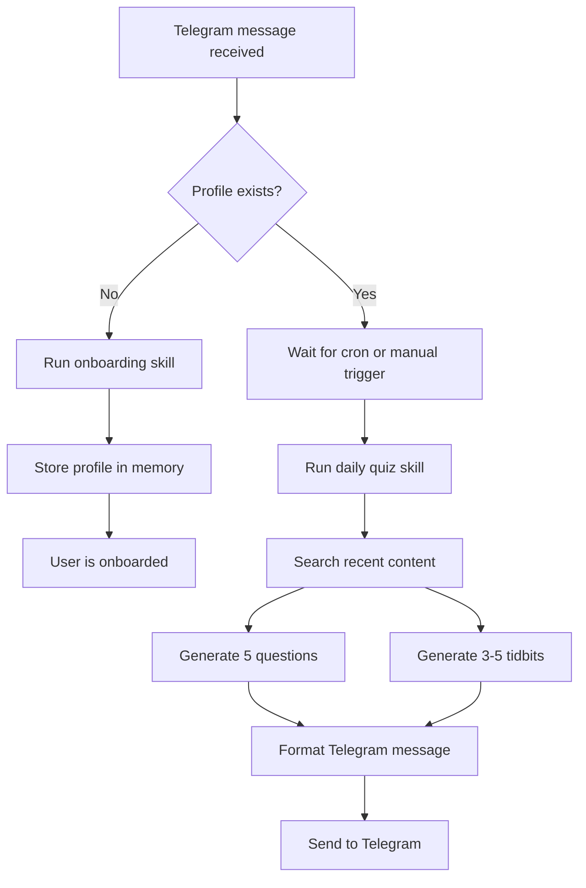
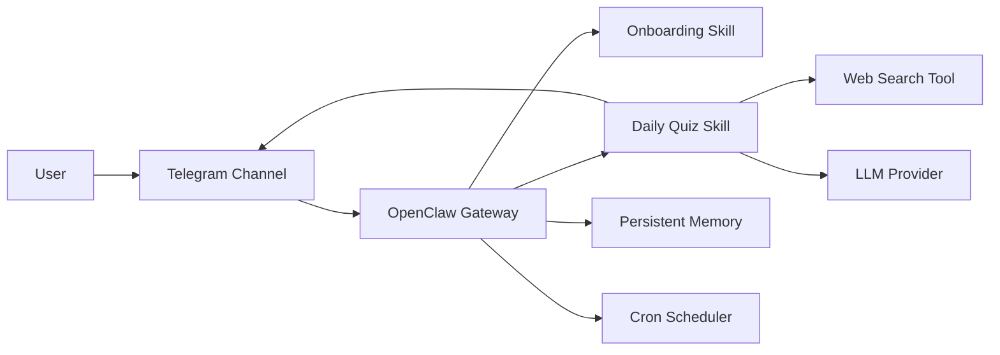

# Project Documentation

## 1. Project Summary

OpenClaw Telegram Learning Assistant is a personalized AI study companion delivered through Telegram. It gathers user preferences once, stores them in persistent memory, and uses that profile to generate a daily learning brief with interview questions and technical insights.

The project is designed to be practical, self-hostable, and easy to understand. It combines prompt engineering, agent workflow design, web search, memory, scheduling, and containerization into a single coherent system.

## 2. Main Objective

The main objective is to build a Telegram bot that:

- detects first-time users automatically
- interviews them about technical interests, experience, goals, and timezone
- stores their profile in persistent memory
- searches the web every day for relevant fresh content
- sends a curated evening brief with exactly 5 interview questions and 3 to 5 tidbits

## 3. Repository Structure

```text
openclaw-telegram-learning-assistant/
├── config/
│   └── openclaw.json
├── skills/
│   ├── user-onboarding/
│   │   └── SKILL.md
│   └── daily-quiz/
│       └── SKILL.md
├── Dockerfile
├── docker-compose.yml
├── entrypoint.sh
├── .env.example
├── README.md
├── architecture.md
└── projectdocumentation.md
```

### Folder Responsibilities

- `config/`: central OpenClaw settings
- `skills/`: agent instructions in Markdown
- root docs: usage, architecture, and implementation details
- Docker files: reproducible local execution

## 4. Workflow Explanation

### 4.1 First Contact

When a user sends a first message on Telegram, the system checks for a saved profile. If none exists, the onboarding skill runs immediately.

### 4.2 Onboarding

The onboarding skill asks four core questions:

1. what technical domains or languages are you interested in
2. what is your experience level
3. what are your learning goals
4. what is your timezone

The answers are normalized and stored as structured JSON in memory.

### 4.3 Daily Learning Brief

At 9 PM in the stored timezone, the cron job starts the daily brief skill. That skill reads the profile, searches the web for current material, generates interview questions and tidbits, and sends the formatted result to Telegram.

## 5. Key Modules and Responsibilities

### User onboarding skill

Responsible for collecting profile data in a conversational way.

### Daily quiz skill

Responsible for content search, synthesis, question generation, and final formatting.

### Telegram plugin

Responsible for all user communication.

### Memory store

Responsible for persistence, repeat lookup, and topic history.

### Cron scheduler

Responsible for proactive evening execution.

### Docker stack

Responsible for repeatable deployment and local development.

## 6. Tech Stack and Why It Was Chosen

| Technology | Role | Why chosen |
|---|---|---|
| OpenClaw | Agent platform | Provides the exact primitives this project needs |
| Node.js | Runtime | Standard environment for the agent and container |
| Ollama | Local model runtime | Private, inexpensive, and easy to develop against |
| Telegram | Delivery channel | Mobile-first, accessible, bot-friendly |
| DuckDuckGo / SearXNG | Search | Supports fresh content discovery |
| Docker | Packaging | Makes setup and submission reproducible |
| Git | Version control | Supports traceability and submission workflow |

## 7. Data Model

### User profile

```json
{
  "domains": ["string"],
  "level": "string",
  "goals": ["string"],
  "timezone": "string"
}
```

### Optional supporting memory keys

- `recent_topics_{{user.id}}`
- `user_engagement_{{user.id}}`
- `last_brief_date_{{user.id}}`

These help avoid repetition and allow light personalization over time.

## 8. Execution Flow



## 9. Architecture Diagram



## 10. Problem-Solving Approach

The project was built by reducing the problem into small deterministic parts:

1. define the data that must be remembered
2. express onboarding as a linear skill
3. express daily generation as a second skill
4. keep Telegram as the single channel
5. use cron for proactive behavior
6. package everything with Docker

This approach keeps the system testable and easy to reason about.

## 11. Advantages

- simple to understand
- easy to extend with more skills
- persistent personalization
- no front-end complexity
- supports local or cloud models
- predictable output format for Telegram

## 12. Drawbacks and Trade-offs

- quality depends on the selected model
- prompt-based behavior can require tuning
- search results may vary by provider
- simple memory storage is not a full database

## 13. Integration Details

### Telegram

The bot communicates only through the Telegram plugin. That means all onboarding and daily brief output is delivered to the chat.

### Memory

The memory layer acts as the state store. It keeps profiles and history so the assistant can continue operating after restarts.

### Search

Search is used only in the daily workflow. It pulls fresh material so the brief does not become stale.

### Scheduler

Cron provides the autonomous evening trigger. The timezone is learned during onboarding and used to schedule the job correctly.

### Model provider

The configuration supports local Ollama and optional cloud providers. The agent logic does not change when the model changes.

## 14. Setup and Installation

### Prerequisites

- Node.js 20 or newer
- Docker and Docker Compose
- Telegram account
- Bot token from BotFather

### Install and run with Docker

```bash
git clone https://github.com/ramalokeshreddyp/openclaw-telegram-learning-assistant.git
cd openclaw-telegram-learning-assistant
cp .env.example .env
```

Edit `.env` and set `TELEGRAM_BOT_TOKEN`.

```bash
docker compose up --build
```

### Local run without Docker

```bash
npm i -g openclaw
ollama serve
ollama pull llama3:8b
openclaw onboard
openclaw gateway start
```

## 15. Configuration Details

### `config/openclaw.json`

This file configures:

- the model provider and model name
- Telegram channel plugin settings
- web search provider
- memory behavior
- cron and standing order support

No secrets are stored in the repository. Tokens are supplied through environment variables.

## 16. Validation and Testing Strategy

### Functional checks

- onboarding starts for first-time users
- profile values are stored correctly
- cron job exists with the expected schedule
- daily quiz format matches the required Markdown structure
- search is called during daily generation

### Manual verification

- send a first Telegram message and observe onboarding
- inspect memory for the saved profile
- trigger the cron job manually
- verify the final message has 5 questions and 3 to 5 tidbits

### Container validation

- build the Docker image
- start the compose stack
- confirm Ollama and the gateway are healthy
- confirm Telegram responses are delivered

## 17. Security and Configuration Hygiene

- secrets live in `.env`, not in source files
- `config/openclaw.json` uses environment substitution
- `.gitignore` excludes local secret material
- no real bot token is committed

## 18. Pros and Cons

### Pros

- strong separation of concerns
- portable deployment
- low operational complexity
- good fit for agent workflows

### Cons

- depends on model quality
- skill prompts need careful tuning
- search freshness is provider-dependent

## 19. Final Assessment

The project is complete, containerized, and documented for submission. It balances practicality and clarity: users get a personalized Telegram learning assistant, while developers get a clean architecture that can be extended without restructuring the entire system.
